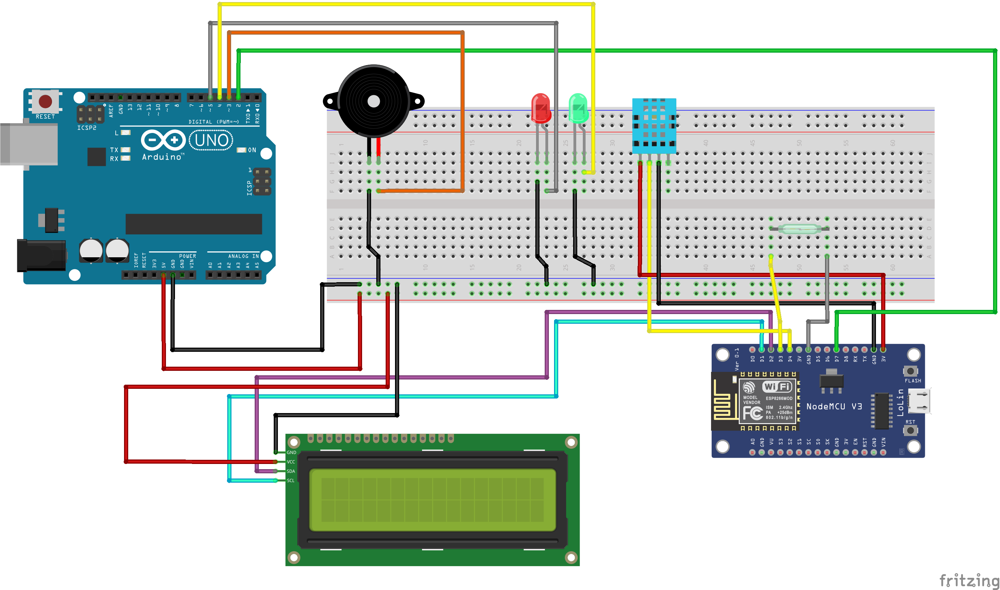
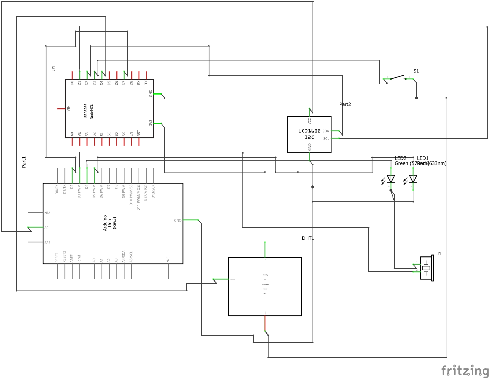

# Introduction
This is a simple IoT-based door security system that can also display temperature and humidity information.

# Working Principle
This system functions as both a door security system and a display for temperature and humidity information. The project utilizes the Blynk cloud for displaying information on the user's end, and it includes an LCD display to show the data.

- The Arduino controls the LEDs, buzzer, and serves as a power supply for all other components.

- The NodeMCU manages all the logic and sends data to the Blynk cloud, allowing users to view the data through the Blynk app.

# Hardware Components
- Arduio Uno
- Node Mcu
- Magnetic Switch
- 16X2 Lcd Display
- Leds
- Humidity Sensor
- Active Buzzer

# Connection Diagram

# Result Images
.jpg)
.jpg)
.jpg)
